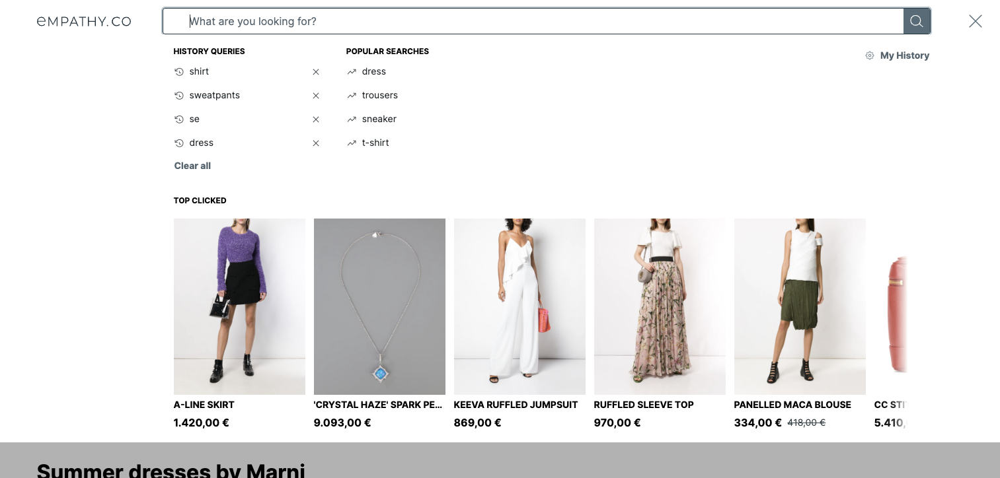

<div grid="~ cols-6 gap-4">

  <div class="col-start-1 col-span-1">
  <ModulesIndex :currentItem="0" :nextPage="15"/>
  </div>

  <div class="col-start-2 col-span-5">

### **Empathize**

#### The Empathize is a modal-like container with an open/close state. Its content relies on other modules / components that are rendered in.

The Empathize Module is a core part of the search experience, tied to the action of searching. It gets opened when the **search box** has been **focused**. Provides an easy access to products and suggested queries while the user is **typing** or **about to search**.

  

</div>
</div>

<style>
p {
  margin: 16px 0 32px;
}
</style>


---

<div grid="~ cols-6 gap-4">

  <div class="col-start-1 col-span-1">
  <ModulesIndex :currentItem="0" :nextPage="16"/>
  </div>

  <div class="col-start-2 col-span-5">

  <h4 class="mt-0"> The Empathize is coupled to the events that update its module's state:</h4>

`empathize.vue`
```ts {all|1-4|5-8|9-16|all}
eventsToOpenEmpathize: {
  type: Array as PropType<XEvent[]>,
  default: () => ['UserFocusedSearchBox', 'UserIsTypingAQuery', 'UserClickedSearchBox']
},
eventsToCloseEmpathize: {
  type: Array as PropType<XEvent[]>,
  default: () => ['UserClosedEmpathize', 'UserSelectedASuggestion', 'UserPressedEnterKey', 'UserBlurredSearchBox']
},

// Triggered on open or close
const changeOpen = useDebounce((newOpen: boolean) => {
  /**
   * Changes the state of Empathize `isOpen` and emits the `EmpathizeOpened` or 
   * `EmpathizeClosed` events if the state really changes.
  */
}, 0);
```
</div>
</div>

<!--
Clicks:
* Prop events to open
* Prop events to close
* Method that trigger when the empathize opens or close.
-->

---

<div grid="~ cols-6 gap-4">

<div class="col-start-1 col-span-1">
<ModulesIndex :currentItem="0" :nextPage="17"/>
</div>

<div class="col-start-2 col-span-5">

<h4 class="mt-0">Empathize Usage Example:</h4>

```html {all|7-9|3-4|1}
<Empathize :animation="fade" :eventsToOpenEmpathize="['CustomOpenEmpathize']">
  <template>
    <h1>Suggestions</h1>
    <CustomSuggestions />
  </template>
</Empathize>
<BaseEventButton :events="['CustomOpenEmpathize']">
  Open Empathize
</BaseEventButton>
```

  <v-click at="0"><div class="description ml-2 mb-0">1. The Empathize is opened when the button is clicked, as it emits the event defined to open empathize.</div></v-click>
  <v-click at="1"><div class="description ml-2 mb-0 mt-0">2. The content displayed inside the predictive layer.</div></v-click>
  <v-click at="2"><div class="description ml-2 mb-0 mt-0">3. The animation is imported from the x-component's library and then defined a constant to be passed as a prop.</div></v-click>
</div>
</div>
