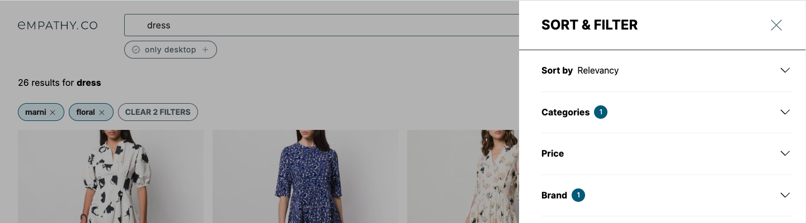

<div grid="~ cols-6 gap-4">

  <div class="col-start-1 col-span-1">
  <ModulesIndex :currentItem="2" :nextPage="19"/>
  </div>

  <div class="col-start-2 col-span-5">

### **Facets**

#### Stores and controls everything related to filtering in the requests.

The wiring of the module handles events that change the facets's state directly or requires it to change (to render **filtering options**, manage **selected filters** state...).

There are different **types of filters**: simple, hierarchical, range... To help with their rendering specificities, there are pre-made [list components](https://github.com/empathyco/x/tree/main/packages/x-components/src/x-modules/facets/components/lists) (for sorted lists, for adding a search input, a collapse...).

<br/>



</div>
</div>

---

<div grid="~ cols-6 gap-4">

  <div class="col-start-1 col-span-1">
  <ModulesIndex :currentItem="2" :nextPage="20"/>
  </div>

  <div class="col-start-2 col-span-5">

<h4 class="mt-0">Modify filters behavior:</h4>

<p class="font-bold !mb-2">· Configure a filter to behave as a single selector:</p>

###
By default, filters are expected to be multiselectable. This can be changed by implementing the [`SingleSelectModifier`](https://github.com/empathyco/x/blob/main/packages/x-components/src/x-modules/facets/entities/single-select.modifier.ts) class before initializing the setup, this will create the filter instance with its coupled select & deselect logic.

<p class="description !mb-0">The filter <a href="https://github.com/empathyco/x/blob/main/packages/x-components/src/main.ts#L13">can be registered by <code>facetId</code></a>:</p>

```ts {all}
FilterEntityFactory.instance.registerModifierByFacetId('age_facet', SingleSelectModifier);
```

<p class="description !mb-0">Or <a href="https://github.com/empathyco/x/blob/main/packages/x-components/src/main.ts#L20">
registered by <code>modelName</code></a>, thus then this would apply to all facets of this type:</p>
```ts {all}
FilterEntityFactory.instance.registerModifierByFilterModelName('HierarchicalFilter', SingleSelectModifier);
```

<p class="font-bold !mt-8 !mb-2">· Configure a filter to keep selected:</p>

###
<p class="!mb-0">This can be done by implementing the <a href="https://github.com/empathyco/x/blob/main/packages/x-components/src/x-modules/facets/entities/sticky.modifier.ts"><code>StickyModifier</code></a> class. This will enrich the filter with the <code>keepSticky</code> flag, if set to true, this will keep the filter selected.</p>

```ts {all}
FilterEntityFactory.instance.registerModifierByFacetId('brand_facet', StickyModifier);
```

</div>
</div>


---

<div grid="~ cols-6 gap-4">
  <div class="col-start-1 col-span-1">
  <ModulesIndex :currentItem="2" :nextPage="21"/>
  </div>

  <div class="col-start-2 col-span-5">
  <h4 class="mt-0">Facets Usage Example:</h4>

```ts {None|all}
    facetsInStore = [{
    id: 'identifiableFacet',
    label: 'identifiableFacet',
    modelName: 'SimpleFacet',
    filters: [...]
  },
  {
    id: 'hierarchicalFacet',
    label: 'Hierarchical Facet',
    modelName: 'HierarchicalFacet',
    filters: [...]
  }];
```
```html {None|all}
<Facets>
    <template #identifiableFacet="{ facet, selectedFilters }">
      <FiltersList v-slot="{filter}">
        {{ filter.label }}
      </FiltersList>
    </template>
    <template #hierarchical-facet="{ facet, selectedFilters }">
      <FiltersList v-slot="{filter}">
        <HierarchicalFilter :filter="filter" />
      </FiltersList>
    </template>
</Facets>
```
<v-click at="2">
<div class="description ml-2 mb-0">1. All the facets use a dynamic slot</div>
<div class="description ml-2 mb-0 mt-0">2. The filters of the facet of type `HierarchicalFacet` uses the filter component of `hierarchical-filter`</div>
<div class="description ml-2 mb-0 mt-0">3. The filters of the facet of id `identifiableFacet` show just the name of the filter</div>
</v-click> 

</div>
</div>
