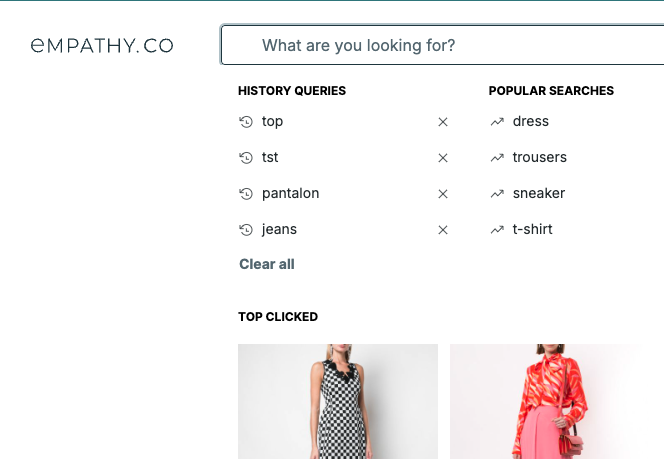
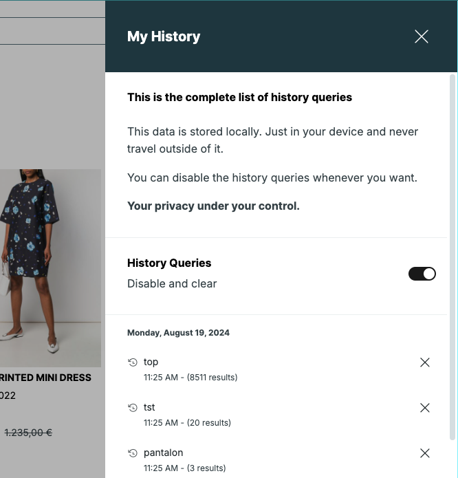

<div grid="~ cols-6 gap-4">

  <div class="col-start-1 col-span-1">
  <ModulesIndex :currentItem="3" :nextPage="22"/>
  </div>

  <div class="col-start-2 col-span-5">

### **History Queries**

####  Module containing the queries already searched by the user.

Used to handle the logic for suggesting past queries, the `LocalStorage`, what queries are stored ot not, logic to remove them... Usually located inside the **Empathize** and into a dedicated **aside modal** that would enable users to handle the full list and even opt-out of storing their history queries.

<div grid="~ cols-2 gap-4">
  <div>


  </div>

  <div>


  </div>

</div>

</div>
</div>

<style>
p  {
  margin-bottom: 0;
}
</style>

---

<div grid="~ cols-6 gap-4">

  <div class="col-start-1 col-span-1">
  <ModulesIndex :currentItem="3" :nextPage="23"/>
  </div>

  <div class="col-start-2 col-span-5">

  <h4 class="mt-0">The basic approach for the module is a list of the suggestions comming from the history queries store.</h4>

`history-queries.vue`
```html {all|1,3,16|3-14|4,8,12,13|5-7|8-12}
<BaseSuggestions v-bind="$attrs" :suggestions="historyQueries">
  <template #default="baseScope">
    <slot name="suggestion" v-bind="{ ...baseScope }">
      <HistoryQuery :suggestion="baseScope.suggestion">
        <template #default="historyQueryScope">
          <slot name="suggestion-content" v-bind="{ ...baseScope, ...historyQueryScope }" />
        </template>
        <template #remove-button-content="removeHistoryQueryScope">
          <slot name="suggestion-remove-content" 
                v-bind="{ ...baseScope, ...removeHistoryQueryScope }"
          />
        </template>
      </HistoryQuery>
    </slot>
  </template>
</BaseSuggestions>
```

<v-click at="0"><div class="description ml-2 mb-0">1. Use of base components: <code>base-suggestions</code> and <code>base-suggestion</code>.</div></v-click>
  <v-click at="1"><div class="description ml-2 mb-0 mt-0">2. All the content can be customized. The slots have the suggestion info exposed.</div></v-click>
  <v-click at="2"><div class="description ml-2 mb-0 mt-0">3. A `HistoryQuery` is just a <code>base-suggestion</code> and a remove button to clear it from the store.</div></v-click>
  <v-click at="3"><div class="description ml-2 mb-0 mt-0">4. Slot for the history query (normally the text of the query being suggested).</div></v-click>
  <v-click at="4"><div class="description ml-2 mb-0 mt-0">5. Slot for the remove button.</div></v-click>
</div>
</div>

---

<div grid="~ cols-6 gap-4">

  <div class="col-start-1 col-span-1">
  <ModulesIndex :currentItem="3" :nextPage="24"/>
  </div>

  <div class="col-start-2 col-span-5">

<h4 class="mt-0">History Queries Usage Example:</h4>

```html {all|7-9|10-12}
<HistoryQueries>
  <HistoryQuery
    class="x-suggestion-group-md"
    :suggestion="suggestion"
    suggestionClass="x-suggestion x-suggestion-md"
  >
    <template #default="{ query }">
      <Highlight :text="suggestion.query" :highlight="query" />
    </template>
    <template #remove-button-content>
      <Minus class="x-icon-md" />
    </template>
  </HistoryQuery>
</HistoryQueries>
```
<v-click at="0"><div class="description ml-2 mb-0 mt-0">1. The `history-query` has the suggested matching part with the current query highlighted</div></v-click>
<v-click at="1"><div class="description ml-2 mb-0 mt-0">2. The remove button slot is customized with a minus icon</div></v-click>

</div>
</div>
