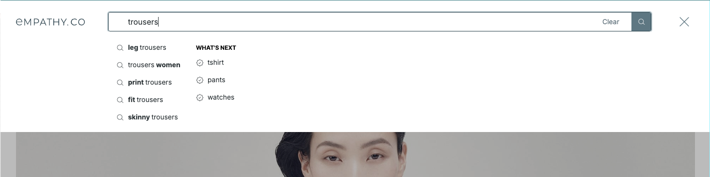
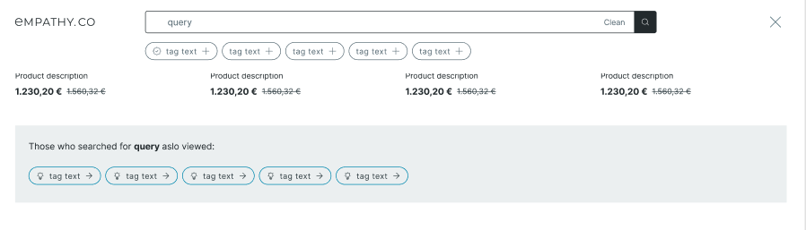
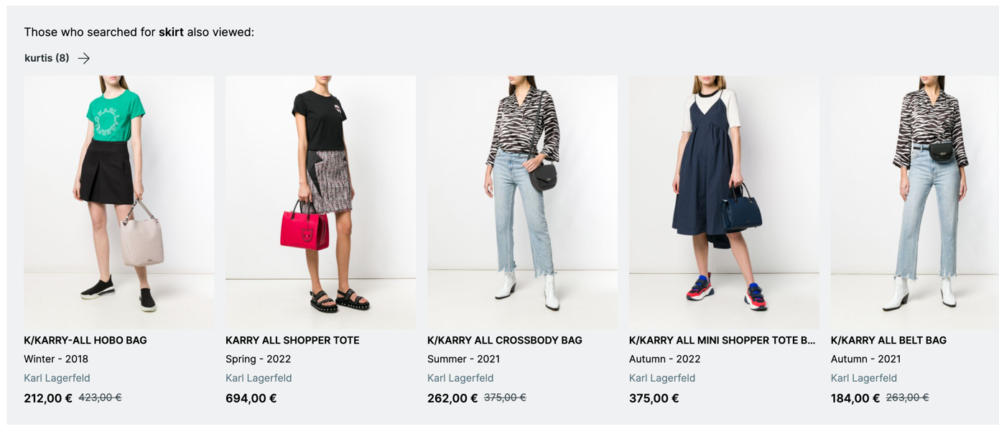

  

  <ModulesIndex :currentItem="4" :nextPage="25"/>
  

  

### **Next Queries**

#### Module to handle terms usually searched by the users after the current query.

The next queries are requested to their own endpoint through the adapter, and the module stores the results. The <a href="https://github.com/empathyco/x/blob/main/packages/x-components/src/x-modules/next-queries/components/next-queries.vue"><code>next-queries</code></a> and <a href="https://github.com/empathyco/x/blob/main/packages/x-components/src/x-modules/next-queries/components/next-query.vue"><code>next-query</code></a> components follow a similar approach of using `base-suggestions` for the listing and `base-suggestion` for the individual elements that we saw previously.

#### They can be shown as:
A list of queries, inside the predictive layer:

---

  

  <ModulesIndex :currentItem="4" :nextPage="26"/>
  

  

As a list of queries, scattered in the results grid:

---

  

  <ModulesIndex :currentItem="4" :nextPage="27"/>
  

  

Or even the module can also request and store a preview of the results of requesting that term, and display them as a sliding panel of results:

*There is already a dedicated component called <a href="https://github.com/empathyco/x/blob/main/packages/x-components/src/x-modules/next-queries/components/next-query-preview.vue"><code>next-query-preview</code></a> in the module for this.

