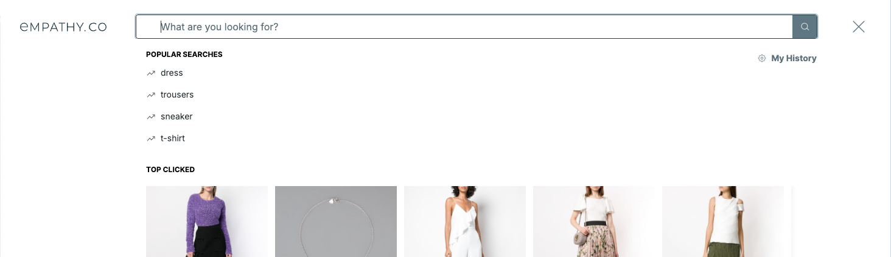
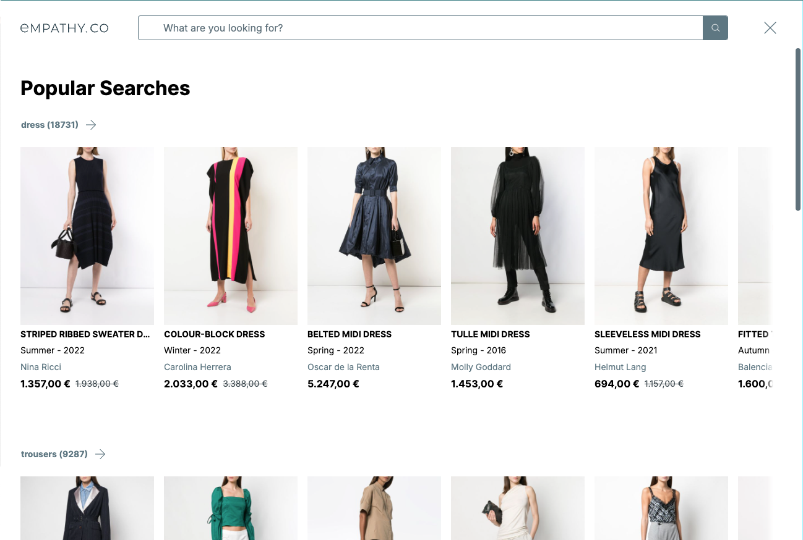

  

  <ModulesIndex :currentItem="5" :nextPage="28"/>
  

  

### **Popular Searches**

#### Popular searches are the most searched terms, likely to be clicked by the user.

Popular searches are requested to their own endpoint, this can be done at any time as they don't depend on the current query. The wiring handles when to request them and the module stores them.

Once again, a pair of components, [`popular-search`](https://github.com/empathyco/x/blob/main/packages/x-components/src/x-modules/popular-searches/components/popular-search.vue) and [`popular-searches`](https://github.com/empathyco/x/blob/main/packages/x-components/src/x-modules/popular-searches/components/popular-searches.vue), based on `base-suggestions` and `base-suggestion`, are enough to render the information in this module.

In the X-Archetype they are used to be rendered as a list of queries inside the predictive layer (empathize) when the search input is focused without a query, but they also can be displayed in the main grid zone as a pre-search strategy.

---

  

  <ModulesIndex :currentItem="5" :nextPage="29"/>
  

  

  <h4 class="mt-0">Popular searches shown as main page content before user starts searching.</h4>

  
Each popular searched query is used to be rendered with preview of its results inside a sliding panel.
 

  
  

