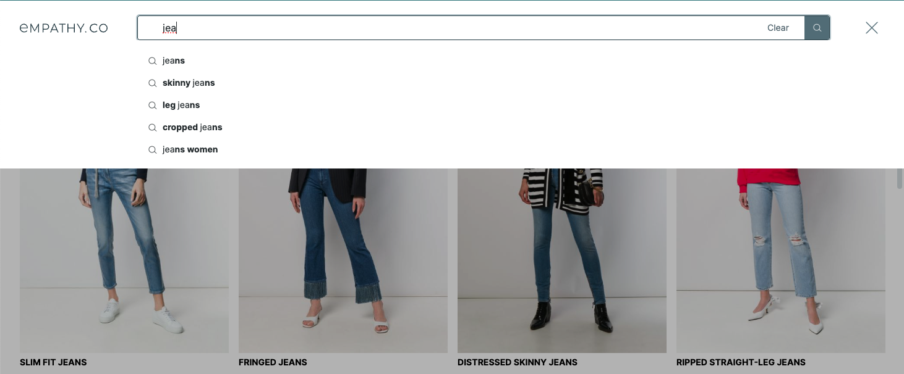

  

  <ModulesIndex :currentItem="6" :nextPage="30"/>
  

  

### **Query Suggestions**

#### It handles all the suggestions given while the user is typing in the search box.

Autocomplete is part of any worthwhile search experience. The module's wiring checks when the user is typing a query to request for suggestions and store them in the module. A dedicated endpoint receives the query and returns these query suggestions.

Two components using `base-suggestions` and `base-suggestion` handle the rendering, [`query-suggestions`](https://github.com/empathyco/x/blob/main/packages/x-components/src/x-modules/query-suggestions/components/query-suggestions.vue) and [`query-suggestion`](https://github.com/empathyco/x/blob/main/packages/x-components/src/x-modules/query-suggestions/components/query-suggestion.vue).

  

