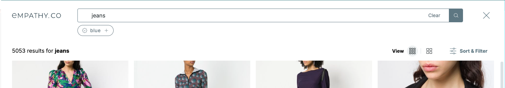

<div grid="~ cols-6 gap-4">

  <div class="col-start-1 col-span-1">
  <ModulesIndex :currentItem="7" :nextPage="31"/>
  </div>

  <div class="col-start-2 col-span-5">

### **Related Tags**

#### Additional keywords to complement the current search.

The Related Tags Module depends entirely of the query, so when a query is accepted the request for the tags will be made and the response stored. The module needs to store the related tags, the selected suggestions and make request calls through its specific adapter.

Related Tags are treated as buttons instead of suggestions, so the components for rendering are a regular list of buttons, but the customization options with slots are very similar.



</div>
</div>

---

<div grid="~ cols-6 gap-4">

  <div class="col-start-1 col-span-1">
  <ModulesIndex :currentItem="7" :nextPage="32"/>
  </div>

  <div class="col-start-2 col-span-5">

<h4 class="mt-0">Related Tags Usage Example:</h4>

<br />

```html {all|1,10|3-8|2,4|6-7|all}
<SlidingPanel v-if="$x.relatedTags.length">
  <RelatedTags :highlightCurated="true">
    <template #related-tag-content="{ relatedTag, isSelected, shouldHighlightCurated }">
      <CuratedCheckIcon v-if="shouldHighlightCurated" />
      {{ relatedTag.tag }}
      <CrossTinyIcon v-if="isSelected" />
      <PlusIcon v-else />
    </template>
  </RelatedTags>
</SlidingPanel>
```
<v-click at="0"><div class="description ml-2 mb-0">1. Related Tags are rendered within a sliding panel</div></v-click>
<v-click at="1"><div class="description ml-2 mb-0 mt-0">2. Slot for customizing related tag item's content.</div></v-click>
<v-click at="2"><div class="description ml-2 mb-0 mt-0">3. If the related tag is curated it will display a special icon on the left.</div></v-click>
<v-click at="3"><div class="description ml-2 mb-0 mt-0">4. Selected/Unselected status also can be rendered differently.</div></v-click>

</div>
</div>
