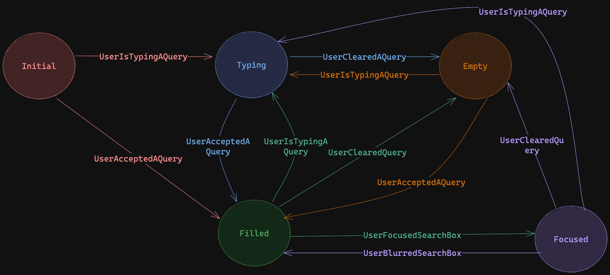

<div grid="~ cols-6 gap-4">

  <div class="col-start-1 col-span-1">
  <ModulesIndex :currentItem="10" :nextPage="37"/>
  </div>

  <div class="col-start-2 col-span-5">

### **Search Box**

#### This module contains all the logic related to the search input. It is the source of truth for the `query` and hence most of the other modules.

<div class="mt-4">

##### · Mirrors the content of the search input to the store and emits that the query has changed.
##### · Emits events for most of the interactions that can be done with an input.
##### · Keeps track of the actions made by the user with a **state machine**.
</div>



</div>
</div>


---

<div grid="~ cols-6 gap-4">

  <div class="col-start-1 col-span-1">
  <ModulesIndex :currentItem="10" :nextPage="38"/>
  </div>

  <div class="col-start-2 col-span-5">

<p class="!mt-0"><code>search-box.vue</code></p>

```html {all|3-4|5-7|8-11|12|14|13,15-18|all}
<input
  ref="input"
  @mouseenter="emitUserHoveredInSearchBox"
  @mouseleave="emitUserHoveredOutSearchBox"
  @blur="emitUserBlurredSearchBox"
  @click="emitUserClickedSearchBox"
  @focus="emitUserFocusedSearchBox"
  @input="emitUserIsTypingAQueryEvents"
  @keydown.enter="emitUserPressedEnterKey"
  @keydown.up.down.prevent="emitUserPressedArrowKey"
  @beforeinput="preventSpecialKey"
  v-on="$listeners"
  :maxlength="maxLength"
  :value="query"
  autocomplete="off"
  enterkeyhint="search"
  inputmode="search"
  type="search"
/>
```

<v-click at="0"><div class="description ml-2 mb-0 mt-0">1. Control the position of the mouse related to the input.</div></v-click>
  <v-click at="1"><div class="description ml-2 mb-0 mt-0">2. Focus related events (normally linked to showing the empathize).</div></v-click>
<v-click at="2"><div class="description ml-2 mb-0 mt-0">3. Typing related events (showing suggestions).</div></v-click>
<v-click at="3"><div class="description ml-2 mb-0 mt-0">4. Passed on events.</div></v-click>
<v-click at="4"><div class="description ml-2 mb-0 mt-0">5. The value mirrored in the store.</div></v-click>
<v-click at="5"><div class="description ml-2 mb-0 mt-0">6. Input configurations.</div></v-click>
</div>
</div>
