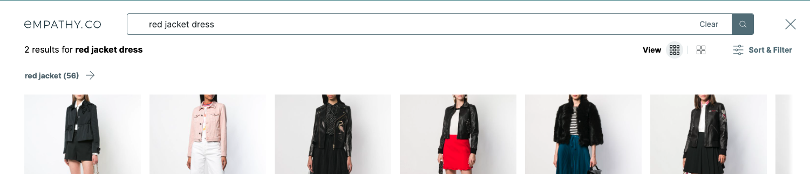

<div grid="~ cols-6 gap-4">

  <div class="col-start-1 col-span-1">
  <ModulesIndex :currentItem="9" :nextPage="35"/>
  </div>

  <div class="col-start-2 col-span-5">

### **Search**

#### The search module contains the results for the current query, as well as several components used to show the results, modify the sort, render the spellchecked query, etc.

<div grid="~ cols-3 gap-6">
<div class="col-span-2">

The wiring makes the search requests through the search endpoint adapter and stores the response in the module:
##### · The different result object types: **regular results, promoted, banners, partials**, etc.
##### · The **number of results** for a query.
##### · The available **facets** related to that searched query. 
##### · And also keeps track of the **pagination**.

<p class="description !mt-6 !mb-0">*Some of this data will be consumed in other parts of the setup and other will be handled by the search module itself.</p>
</div>

<div>

<p class="description !mb-0"><b>· Result</b>. A product with all the info.</p>
<p class="description !mt-1 !mb-0"><b>· Banner</b>. A full grid width ad.</p>
<p class="description !mt-1 !mb-0"><b>· Promoted</b>. Inside the grid, as a sponsored item within the normal results and in a pre-configured position.</p>
<p class="description !mt-1 !mb-0"><b>· Partial</b>. When the query has few results and can be divided in other more relevant queries. Example: with the query <code>red jacket dress</code>, we obtain partials as <code>red jacket</code>.</p>
</div>
</div>


</div>
</div>

---

<div grid="~ cols-6 gap-4">

  <div class="col-start-1 col-span-1">
  <ModulesIndex :currentItem="9" :nextPage="36"/>
  </div>

  <div class="col-start-2 col-span-5">

<h4 class="!mt-0"> There are lists and/or individual components for almost each type of result, and they are included in a single grid that contains all these elements but each with its own style and rendering strategy.</h4>

<div grid="~ cols-2 gap-4">
<div>

To achieve this, the `result-list` can wrap any other list in the module. It will render the results plus the elements of that list, and the next list that gets wrapped will do the same.

**Chained lists work because they are injected with the elements to be rendered from the previous list.**

Lastly, the way each type of element will render is determined by the named slots in the last chained list. 
</div>

<div class="mt-3">

```html {all}
<ResultsList>
  <PromotedsList>
    <BannersList>
      <template #result="{ item }">
        <Result :item="item" />
      </template>
      <template #banner="{ item }">
        <Banner :item="item" />
      </template>
      <template #promoted="{ item }">
        <Promoted :item="item" />
      </template>
    </BannersList>
  </PromotedsList>
</ResultsList>
```
</div>
</div>

</div>
</div>
