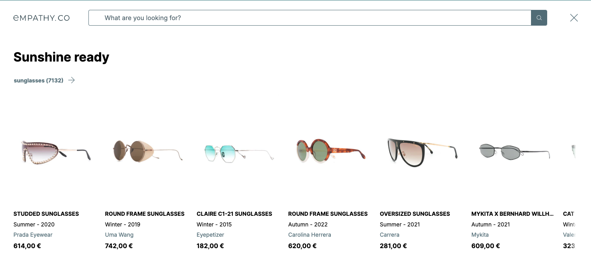

<div grid="~ cols-6 gap-4">

  <div class="col-start-1 col-span-1">
  <ModulesIndex :currentItem="15" :nextPage="44"/>
  </div>

  <div class="col-start-2 col-span-5">

  ### **Queries Preview**

#### Retrieves a preview of the results of a given query. It is a pre-search strategy to display content before the user searches.

The queries to be previewed are defined via **[Snippet Config](https://github.com/empathyco/x/blob/main/packages/x-components/src/x-installer/api/api.types.ts#L112)** by passing an array of objects containing a **query**. The module requests those queries from the **search endpoint** in sequential order and catches them to avoid unnecessary requests if they have already been saved. This also allows us to save multiple queries and reuse components without colliding.



</div>
</div>

---

<div grid="~ cols-6 gap-4">

  <div class="col-start-1 col-span-1">
  <ModulesIndex :currentItem="15" :nextPage="45"/>
  </div>

   <div class="col-start-2 col-span-5">
   <h4 class="mt-0">Queries Preview Usage Example:</h4>

```html {all|1-7,22|8-14|all}
<QueryPreviewList
  v-if="queriesPreviewInfo"
  :debounceTimeMs="250"
  :queriesPreviewInfo="queriesPreviewInfo"
  :persistInCache="true"
  #default="{ queryPreviewInfo, totalResults, results }"
>
  <QueryPreviewButton
    :queryPreviewInfo="queryPreviewInfo"
  >
    {{ queryPreviewInfo.query }}
    ({{ totalResults }})
    <ArrowRightIcon class="x-icon-lg" />
  </QueryPreviewButton>
  <SlidingPanel>
    <Result
      v-for="result in results"
      :key="result.id"
      :result="result"
    />
  </SlidingPanel>
</QueryPreviewList>
```
<v-click at="0"><div class="description ml-2 mb-0">1. <a href="https://github.com/empathyco/x/blob/main/packages/x-components/src/x-modules/queries-preview/components/query-preview-list.vue"><code>QueryPreviewList</code></a>. It renders all the preview results for a given query. It handles the logic of checking if a query has been loaded, and binds all the <a href="https://github.com/empathyco/x/blob/main/packages/x-components/src/x-modules/queries-preview/components/query-preview.vue"><code>QueryPreview</code></a> component's data in its default slot.</div></v-click>
<v-click at="1"><div class="description ml-2 mb-0 mt-0">2. If the <a href="https://github.com/empathyco/x/blob/main/packages/x-components/src/x-modules/queries-preview/components/query-preview-button.vue"><code>QueryPreviewButton</code></a> is clicked, it will emit the event <code>UserAcceptedAQueryPreview</code> and a search request will be performed.</div></v-click>

</div>
</div>
