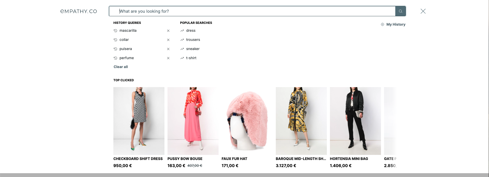
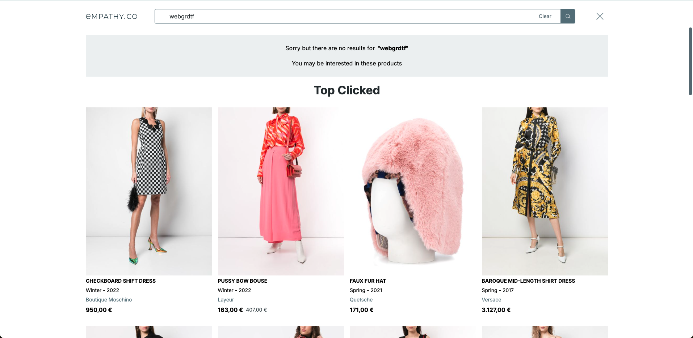

  

  <ModulesIndex :currentItem="13" :nextPage="41"/>
  

  

### **Recommendations**

#### The Top Clicked products, likely to be clicked by the user and not bound to a specific part of the website.

The dedicated endpoint returns the recommendations and result objects. The idea is requesting the recommendation right away because the request is not expected to change. The module has a highly [customizable component](https://github.com/empathyco/x/blob/main/packages/x-components/src/x-modules/recommendations/components/recommendations.vue) to render the list of recommendations
as results.

In the X-Archetype they are used to be rendered inside the predictive layer (empathize) when the search input is focused without a query, or when no-results are found, as fallback content.

---

  

  <ModulesIndex :currentItem="13" :nextPage="42"/>
  

  

  <h4 class="mt-0">Top Clicked recommendations in a no-results scenario.</h4>

  

