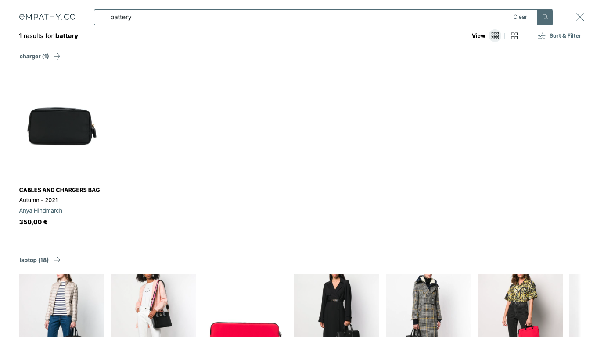

  

  <ModulesIndex :currentItem="16" :nextPage="46"/>
  

  

  
  ### **Semantic Queries**

#### This module is in charge of requesting and rendering meaningful search results.

Usually rendered when there are few or no results, they are another kind of suggestion with its endpoint adapter, which has a special configuration option, the `threshold`, to filter out terms that are not relevant enough.

