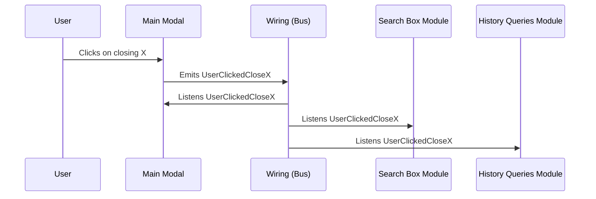

## Wiring

 

##### · Each module has its own wiring to **listen to events** emitted across all the app and **trigger actions** from the module itself.

##### · Multiple modules can listen to the **same event** and react to it.
##### · The wiring of the modules is fully **customizable** from within a client setup, so you can add, remove or expand listeners and actions of any module.

 

### Wiring flow example

 

<!--
* Modal is closed
* Query is cleared
* HQ are cleared
-->